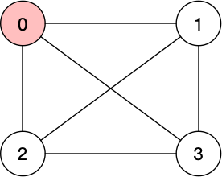

# 如何搭建一个VNT测试网络

这篇文章教你如何搭建一个VNT测试网络，并且以搭建单机器4个VNT见证人节点的测试网络为例。


VNT区块链网络需要发送交易选举见证人节点，如果没有初始的见证人，就没有区块产生，选举交易就无法打包到区块，就选举不出见证人节点，所以需要初始见证人节点。它们负责在主网启动之前，替代见证人负责执行交易，打包区块，然有给定数量的见证人注册后，产生区块和共识的权利，就会转移到见证人节点。

初始见证人是不能通过交易注册的，是通过创世块文件配置的，创世块配置文件包含初始见证人的账号地址以及p2p地址。


搭建测试网络需要3部分数据：

1. 每个节点的账号
2. 每个节点的p2p地址
3. 每个节点统一的创世块配置文件dpos.json

接下来，我们先生成这3部分数据，再用这3部分数据搭建测试网。


4个见证人节点的VNT网络拓扑。



红色节点0为节点0，作为bootnode节点，bootnode节点下文会介绍，1、2、3为其他见证人节点。

## 生成3部分数据

生成这3部分资料的过程，实际就是创建创始见证人，并把它们的信息写入到创世块的过程。

### 创建4个初始见证人的账号

创建1个测试网络文件目录`testnet`，

```bash
cd ~
mkdir testnet
```

使用`gvnt account new`命令创建节点0的账户，为节点0指定数据目录`node0`，创建账户过程中，会要求输入账户密码，可以直接回车，则密码为空，即无密码：

```bash
➜ gvnt account new --datadir node0
INFO [12-16|14:47:13] Maximum peer count                       VNT=25 LES=0 total=25
Your new account is locked with a password. Please give a password. Do not forget this password.
Passphrase:
Repeat passphrase:
Address: {f31a08c03e03e36214f737755c235e6eadc5502e}
```

"f31a08c03e03e36214f737755c235e6eadc5502e"就是账户的地址，账户被保存的`node0/keystore`目录，keystore下的账户文件，其中是加密后的账户私钥等信息，不可泄露。

```bash
➜ ls node0/keystore
UTC--2018-12-16T04-42-33.665349000Z--f31a08c03e03e36214f737755c235e6eadc5502e
```

可以依照上面的例子，生成`node1, node2, node3`作为节点1，2，3的账户，后续只要`--datadir node_dir`就是对该节点操作。当前，testnet目录下的文件结构应当如下：

```bash
➜ tree .
.
├── node0
│   └── keystore
│       └── UTC--2018-12-16T04-42-33.665349000Z--f31a08c03e03e36214f737755c235e6eadc5502e
├── node1
│   └── keystore
│       └── UTC--2018-12-16T06-43-08.551773000Z--9689e062952b71b825cd9dfc1d1d01a6319c6ebc
├── node2
│   └── keystore
│       └── UTC--2018-12-16T06-47-05.687543000Z--54604da2bad12b66e9aef6b8c04629b68771778e
└── node3
    └── keystore
        └── UTC--2018-12-16T06-47-14.886697000Z--e3d4f3e7d1b82dcc210efe1e0666b45e5a619a2d

9 directories, 5 files
```

### 生成每个节点的p2p地址

p2p地址是每个节点建立连接的地址，我们要先获取每个初始见证人的p2p地址，节点在初次启动时，会自动生成p2p地址。

p2p地址中包含了IP和端口号，我们在启动节点的时候需要指定节点间通信的端口号，节点0到节点4分别分配端口号:12340，12341，12342，12343。

使用如下命令启动节点0，并获取p2p地址。

```bash
➜ gvnt --datadir node0 --port 12340 console
// 省略很多输出
> admin.nodeInfo.enode
"/ip4/127.0.0.1/tcp/12340/ipfs/1kHcch6yuBCgC5nPPSK3Yp7Es4c4eenxAeK167pYwUvNjRo"
```

使用control-D关闭客户端。

可以看到`node0`下多了很多目录和文件，`vntdb`目录中保存了p2p地址，见证人节点应当备份好`vntdb`目录，不然节点重新启动，会生成新的p2p地址，就需要重新注册见证人了。作为初始见证人节点，更应当备份好该目录，因为初始见证人的地址一旦写入到创世块配置文件，是无法修改的。

```bash
➜ ls node0
gvnt     history  keystore vntdb
```

使用同样的方法，可以获得节点1，2，3的p2p地址。

```bash
/ip4/127.0.0.1/tcp/12341/ipfs/1kHJFKr2bzUnMr1NbeyYbYJa3RXT18cEu7cNDrHWjg8XYKB
/ip4/127.0.0.1/tcp/12342/ipfs/1kHfop9dnUHHmtBXVkLB5UauAmACtrsEX5H5t6oCRpdL198
/ip4/127.0.0.1/tcp/12343/ipfs/1kHHWuQNUVV2wgE8SqzQjWhiFQcfpkP5tRVTdJXAPWVj4nR
```

移除节点0的临时数据`gvnt`目录：

```bash
rm -rf node0/gvnt
```

可以使用上述命令，清理节点1，2，3的临时数据，否则使用配置文件初始化节点时会失败。

### 创建创世块配置文件dpos.json

我们需要使用前2步获得的账号和p2p地址，创建测试网络的创世块配置文件dpos.json。该创世块文件可以基于`go-vnt/genesis_dpos.json`的文件进行修改。

dpos.json需要修改

1. 区块周期
2. 见证人节点数
3. 初始的见证人节点的账号和p2p地址。

这是`go-vnt/genesis_dpos.json`的内容：

```json
{
  "config": {
    "chainId": 1012,
    "dpos": {
      "period": 2,
      "witnessesNum": 4,
      "witnessesUrl": [
        "/ip4/127.0.0.1/tcp/5210/ipfs/1kHcch6yuBCsC5nPPSK3Yp7Es4c4eenxAeK167pYwUvNjRo",
        "/ip4/127.0.0.1/tcp/5211/ipfs/1kHJFKr2bzUxMr1NbeyYbYJa3RXT18cEu7cNDrHWjg8XYKB",
        "/ip4/127.0.0.1/tcp/5212/ipfs/1kHfop9dnUHsmtBXVkLB5UauAmACtrsEX5H5t6oCRpdL198",
        "/ip4/127.0.0.1/tcp/5213/ipfs/1kHHWuQNUVV3wgE8SqzQjWhiFQcfpkP5tRVTdJXAPWVj4nR"
      ]
    }
  },
  "timestamp": "0x5c2a3d00",
  "extraData": "0x",
  "gasLimit": "0x47b760",
  "difficulty": "0x1",
  "coinbase": "0x0000000000000000000000000000000000000000",
  "alloc": {
    "0x122369f04f32269598789998de33e3d56e2c507a": {
      "balance": "0x200000000000000000000000000000000000000000000000000000000000000"
    },
    "0x3dcf0b3787c31b2bdf62d5bc9128a79c2bb18829": {
      "balance": "0x200000000000000000000000000000000000000000000000000000000000000"
    },
    "0x42a875ac43f2b4e6d17f54d288071f5952bf8911": {
      "balance": "0x200000000000000000000000000000000000000000000000000000000000000"
    },
    "0xbf66d398226f200467cd27b14e85b25a8c232384": {
      "balance": "0x200000000000000000000000000000000000000000000000000000000000000"
    },
    "0x491f4e8d914e30b1a5e8c804789094fe30971807": {
      "balance": "0x200000000000000000000000000000000000000000000000000000000000000"
    },
    "0xe23f3ed4b6969f29284f667c16761212678c917d": {
      "balance": "0x200000000000000000000000000000000000000000000000000000000000000"
    }
  },
  "witnesses": [
    "0x122369f04f32269598789998de33e3d56e2c507a",
    "0x42a875ac43f2b4e6d17f54d288071f5952bf8911",
    "0x3dcf0b3787c31b2bdf62d5bc9128a79c2bb18829",
    "0xbf66d398226f200467cd27b14e85b25a8c232384"
  ],
  "number": "0x0",
  "gasUsed": "0x0",
  "parentHash": "0x0000000000000000000000000000000000000000000000000000000000000000"
}
```

- "dpos"：包含了dpos的相关配置：见证人数量、产块周期、初始见证人地址。

- "witnesses"：是初始见证人的账号。
- "chainId"：是我们创建的网络的ID，启动节点时需要使用。

在次基础上修改以上数据，就能替换成我们私有网络的配置，周期和见证人数量不变，只修改初始见证人p2p地址和账号即可，然后把修改后的文件保存到testnet目录，命名为`dpos.json`：

```json
{
  "config": {
    "chainId": 1012,
    "homesteadBlock": 1,
    "eip150Block": 2,
    "eip150Hash": "0x0000000000000000000000000000000000000000000000000000000000000000",
    "eip155Block": 3,
    "eip158Block": 3,
    "byzantiumBlock": 4,
    "dpos": {
      "period": 2,
      "witnessesNum": 4,
      "witnessesUrl": [
        "/ip4/127.0.0.1/tcp/12340/ipfs/1kHcch6yuBCgC5nPPSK3Yp7Es4c4eenxAeK167pYwUvNjRo",
        "/ip4/127.0.0.1/tcp/12341/ipfs/1kHJFKr2bzUnMr1NbeyYbYJa3RXT18cEu7cNDrHWjg8XYKB",
        "/ip4/127.0.0.1/tcp/12342/ipfs/1kHfop9dnUHHmtBXVkLB5UauAmACtrsEX5H5t6oCRpdL198",
        "/ip4/127.0.0.1/tcp/12343/ipfs/1kHHWuQNUVV2wgE8SqzQjWhiFQcfpkP5tRVTdJXAPWVj4nR"
      ]
    }
  },
  "nonce": "0x0",
  "timestamp": "0x5b45b949",
  "extraData": "0x",
  "gasLimit": "0x47b760",
  "difficulty": "0x1",
  "mixHash": "0x0000000000000000000000000000000000000000000000000000000000000000",
  "coinbase": "0x0000000000000000000000000000000000000000",
  "alloc": {
    "0x122369f04f32269598789998de33e3d56e2c507a": {
      "balance": "0x200000000000000000000000000000000000000000000000000000000000000"
    },
    "0x3dcf0b3787c31b2bdf62d5bc9128a79c2bb18829": {
      "balance": "0x200000000000000000000000000000000000000000000000000000000000000"
    },
    "0x42a875ac43f2b4e6d17f54d288071f5952bf8911": {
      "balance": "0x200000000000000000000000000000000000000000000000000000000000000"
    },
    "0xbf66d398226f200467cd27b14e85b25a8c232384": {
      "balance": "0x200000000000000000000000000000000000000000000000000000000000000"
    },
    "0x491f4e8d914e30b1a5e8c804789094fe30971807": {
      "balance": "0x200000000000000000000000000000000000000000000000000000000000000"
    },
    "0xe23f3ed4b6969f29284f667c16761212678c917d": {
      "balance": "0x200000000000000000000000000000000000000000000000000000000000000"
    }
  },
  "witnesses": [
    "0xf31a08c03e03e36214f737755c235e6eadc5502e",
    "0x9689e062952b71b825cd9dfc1d1d01a6319c6ebc",
    "0x54604da2bad12b66e9aef6b8c04629b68771778e",
    "0xe3d4f3e7d1b82dcc210efe1e0666b45e5a619a2d"
  ],
  "number": "0x0",
  "gasUsed": "0x0",
  "parentHash": "0x0000000000000000000000000000000000000000000000000000000000000000"
}
```


经过以上操作后，testnet的目录应当如下：

```bash
➜  testnet tree . -L 2
.
├── dpos.json
├── node0
│   ├── history
│   ├── keystore
│   └── vntdb
├── node1
│   ├── history
│   ├── keystore
│   └── vntdb
├── node2
│   ├── history
│   ├── keystore
│   └── vntdb
└── node3
    ├── history
    ├── keystore
    └── vntdb

16 directories, 5 files
```

如果不一样，请再次阅读上面的内容，看缺少的文件是哪一步生成的，执行命令生成。

## 使用数据和文件搭建测试网

### 使用dpos.json初始化每个节点

需要使用上文生成的dpos.json初始化测试网络的节点，不然热河节点都会因为创世块信息不一致无法加入网络。

使用以下命令初始化所有初始见证人节点，以节点0为例。

```bash
➜ gvnt init dpos.json --datadir node0
INFO [12-16|15:29:36] Maximum peer count                       VNT=25 LES=0 total=25
INFO [12-16|15:29:36] Allocated cache and file handles         database=/Users/shitaibin/Workspace/testnet/node0/gvnt/chaindata cache=16 handles=16
INFO [12-16|15:29:36] Writing custom genesis block
INFO [12-16|15:29:36] Persisted trie from memory database      nodes=9 size=1.44kB time=105.62µs gcnodes=0 gcsize=0.00B gctime=0s livenodes=1 livesize=0.00B
INFO [12-16|15:29:36] Successfully wrote genesis state         database=chaindata                                               hash=6104e6…838356
INFO [12-16|15:29:36] Allocated cache and file handles         database=/Users/shitaibin/Workspace/testnet/node0/gvnt/lightchaindata cache=16 handles=16
INFO [12-16|15:29:36] Writing custom genesis block
INFO [12-16|15:29:36] Persisted trie from memory database      nodes=9 size=1.44kB time=64.704µs gcnodes=0 gcsize=0.00B gctime=0s livenodes=1 livesize=0.00B
INFO [12-16|15:29:36] Successfully wrote genesis state         database=lightchaindata                                               hash=6104e6…838356
```


### 启动bootnode节点

VNT网络需要使用bootnode自动建立，其中一个初始见证人节点可作为bootnode，其他节点和该节点建立连接，就会和剩余节点建立连接

```bash
gvnt --networkid 1012 --datadir node0 --port 12340 console
```

### 启动剩余初始见证人节点

节点1的启动命令如下，和生成p2p地址的命令相比，需要指定`--vntbootnode`的p2p地址，即节点0的p2p地址。使用`admin.peers`能查看和本节点建立连接的节点，其中`<peer.ID 1kHcch6yuBCgC5nPPSK3Yp7Es4c4eenxAeK167pYwUvNjRo>`就是节点0的p2p地址，说明他俩已经建立连接。

```bash
gvnt --networkid 1012 --datadir node1 --port 12341 --vntbootnode "/ip4/127.0.0.1/tcp/12340/ipfs/1kHcch6yuBCgC5nPPSK3Yp7Es4c4eenxAeK167pYwUvNjRo" console

// 省略启动打印
> admin.peers
[{
    caps: null,
    id: "<peer.ID 1kHcch6yuBCgC5nPPSK3Yp7Es4c4eenxAeK167pYwUvNjRo>",
    name: "",
    network: {
      inbound: false,
      localAddress: "/ip4/192.168.0.104/tcp/12341",
      remoteAddress: "/ip4/192.168.0.104/tcp/12340",
      static: false,
      trusted: false
    },
    protocols: null
}]
```

启动节点2：

```bash
gvnt --networkid 1012 --datadir node2 --port 12342 --vntbootnode "/ip4/127.0.0.1/tcp/12340/ipfs/1kHcch6yuBCgC5nPPSK3Yp7Es4c4eenxAeK167pYwUvNjRo" console
```

启动节点3：

```bash
gvnt --networkid 1012 --datadir node3 --port 12343 --vntbootnode "/ip4/127.0.0.1/tcp/12340/ipfs/1kHcch6yuBCgC5nPPSK3Yp7Es4c4eenxAeK167pYwUvNjRo" console
```

节点3上的peer信息如下，各节点上都会有3个节点，说明我们的测试网络已经搭建起来了：

```bash
> admin.peers
[{
    caps: null,
    id: "<peer.ID 1kHJFKr2bzUnMr1NbeyYbYJa3RXT18cEu7cNDrHWjg8XYKB>",
    name: "",
    network: {
      inbound: false,
      localAddress: "/ip4/127.0.0.1/tcp/12343",
      remoteAddress: "/ip4/127.0.0.1/tcp/12341",
      static: false,
      trusted: false
    },
    protocols: null
}, {
    caps: null,
    id: "<peer.ID 1kHcch6yuBCgC5nPPSK3Yp7Es4c4eenxAeK167pYwUvNjRo>",
    name: "",
    network: {
      inbound: false,
      localAddress: "/ip4/127.0.0.1/tcp/12343",
      remoteAddress: "/ip4/127.0.0.1/tcp/12340",
      static: false,
      trusted: false
    },
    protocols: null
}, {
    caps: null,
    id: "<peer.ID 1kHfop9dnUHHmtBXVkLB5UauAmACtrsEX5H5t6oCRpdL198>",
    name: "",
    network: {
      inbound: false,
      localAddress: "/ip4/127.0.0.1/tcp/12343",
      remoteAddress: "/ip4/127.0.0.1/tcp/12342",
      static: false,
      trusted: false
    },
    protocols: null
}]
```

### 打包区块

在每个初始见证人节点上解锁账户、开启共识，可以看到区块不断产生。

```bash
personal.unlockAccount(core.coinbase)
bp.start()
```

以上，测试网络就搭建起来了。